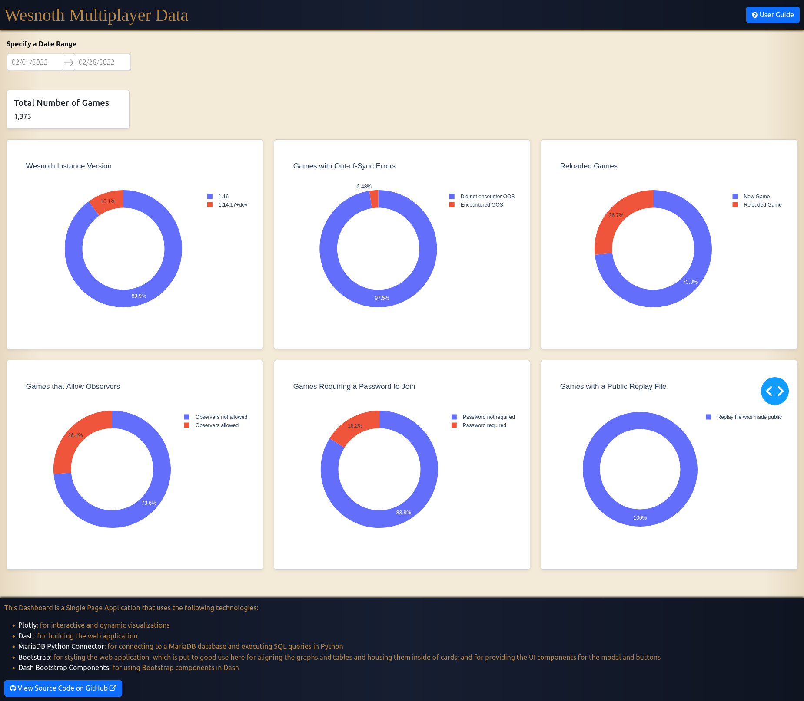
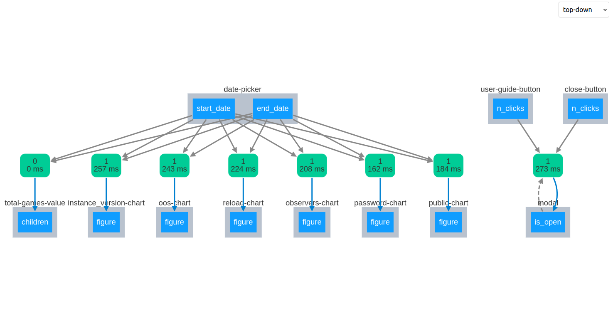

# Wesnoth Multiplayer Data Dashboard

This is a dashboard that allows you to query and visualize data that the [The Battle for Wesnoth Project](https://wiki.wesnoth.org/Project) collects about multiplayer games played on the official server.



## Usage

See [user_guide.md](assets/markdown/user_guide.md) for a detailed user guide.

## Setup for Development

### Python

Python 3.11.5 was used to initially develop the app. To guarantee compatibility, it is recommended to use Python 3.11.5 or higher. You may use a [virtual environment](https://docs.python.org/3/library/venv.html) to isolate the Python version and app dependencies from other Python projects on your system.

#### Testing on Older Python Version

A test was done to see if the app will work on Python 3.9.2. In debug mode, the app works but there is an error message, which the user doesn't see, that gets logged the first time the page was loaded, but the whole app works otherwise. With debug mode set to False, there is no error message at all.

### App Dependencies

Install development dependencies using

```bash
pip install -r requirements/development.txt
```

If you are having issues installing the `mariadb` dependency, see [Install MariaDB Connector/Python](https://mariadb.com/docs/server/connect/programming-languages/python/install/).

### Database

#### Install and Setup MariaDB

The app fetches raw data from a MariaDB database. For development purposes, you need to install and run your own local MariaDB server instance. A `.sql` file containing a three-day sample from the actual database is provided in [tests/three_days_sample_data.sql](tests/three_days_sample_data.sql). You can use this file to create a local database for the app to read. The definitions of what the tables and columns in the database represent can be found [here](https://github.com/wesnoth/wesnoth/blob/master/utils/mp-server/table_definitions.sql).

1. Install MariaDB. If you are having great difficulty installing MariaDB on your system, you can try [Installing and Using MariaDB via Docker](https://mariadb.com/kb/en/installing-and-using-mariadb-via-docker/)
2. Log in to MariaDB in a terminal.
3. Create a database.

    ```bash
    CREATE DATABASE {database_name};
    ```

    - Replace `{database_name}` with any name of your choosing.

4. Log out of MariaDB.
5. Import the sql file into the database.

    ```bash
    mariadb -u {username} -p {database_name} < tests/three_days_sample_data.sql
    ```

    - Replace `{username}` with your MariaDB username.
    - Replace `{database_name}` with the name of the database you created in step 3.

6. Using the MariaDB CLI or a GUI tool such as [HeidiSQL](https://www.heidisql.com/), verify that the database was created successfully and that the tables and data were imported correctly.

#### Set Environment Variables

The app reads database credentials from environment variables. The following environment variables must be set:

| Variable     | Description                                      |
|--------------|--------------------------------------------------|
| `DB_HOST`    | The host of the database server.                 |
| `DB_PORT`    | The port of the database server.                 |
| `DB_USER`    | The username to use to connect to the database.  |
| `DB_PASSWORD`| The password to use to connect to the database.  |
| `DB_DATABASE`    | The name of the database to connect to.          |

It is up to you to determine how to set these environment variables. One example is provided below.

##### Example Environment Variable Declaration Using Visual Studio Code

Visual Studio Code can be configured to set environment variables when opening any terminal in the editor. This is done by adding the environment variables to the `.vscode/settings.json` file.

```json
{
    "terminal.integrated.env.windows": {
        "DB_USER": "root",
        "DB_PASSWORD": "somepassword",
        "DB_HOST": "127.0.0.1",
        "DB_PORT": "3306",
        "DB_DATABASE": "wesnoth_mp_database"
    },
}
```

For linux and macOS, `terminal.integrated.env.linux` and `terminal.integrated.env.osx` are also available.

### Run the App

Run the app using

```bash
python app.py
```

The app will be served at port 8050 of your local host. You can view the app in a browser.

## Technology Stack

See [footer_technology_stack.md](assets/markdown/footer_technology_stack.md) for a list of the technologies used in this app.

Developer Notes:

- [React](https://react.dev/) is also involved, because Plotly uses it for their UI components. You don't need to know React unless you want to actually [make your own Plotly components or start modifying existing ones](https://dash.plotly.com/react-for-python-developers). Sometimes, the JavaScript console of the browser will contain error messages that you won't otherwise see in your main terminal.
- [Flask](https://flask.palletsprojects.com) is also involved, because Dash apps are actually Flask apps, but you're not really meant to tinker with most of the Flask parts unless you are planning to [do something outside of Plotly Dash coding conventions](https://hackersandslackers.com/plotly-dash-with-flask/).

## App Observability

The [Callback Graph](https://dash.plotly.com/devtools#callback-graph) makes it easy to track app state, app data, callback function call counts, and callback function execution time. Additionally, we get to see the order in which the callbacks are executed and their respective triggers.



## Testing

The `tests/` directory contains tests for the app. The tests are written using [pytest](https://docs.pytest.org/). To run the tests, use

```bash
pytest
```

### pytest Plugins

The following pytest plugins are used:

| Package | Description |
| --- | --- |
| [pytest-mock](https://pytest-mock.readthedocs.io/en/latest/) | Provides a `mocker` fixture that is used to mock functions and classes. |
| [pytest-cov](https://pytest-cov.readthedocs.io/en/latest/) | (Optional Use). Generates coverage reports. |
| [pytest-env](https://github.com/pytest-dev/pytest-env) | You need to use this to set environment variables during test. The same variables that you set in order to run the app can also be used for testing. See the [pytest readme](https://github.com/pytest-dev/pytest-env) on how to use this. The `pytest.ini` file is in the `.gitignore` list.|

## Deployment

Install production dependencies using

```bash
pip install -r requirements/production.txt
```

To serve this app to end users, it is recommended to use a WSGI server such as [Gunicorn](https://gunicorn.org/) or [Waitress](https://docs.pylonsproject.org/projects/waitress/en/latest/). The [requirements/production.txt](requirements/production.txt) file already specifies Gunicorn, but this can be changed depending on the specific needs of the deployment.

With Gunicorn, the app can be served using the following command:

```bash
gunicorn main:server
```

The command indicates that the `server` variable in the `main.py` file is the WSGI entry point.
